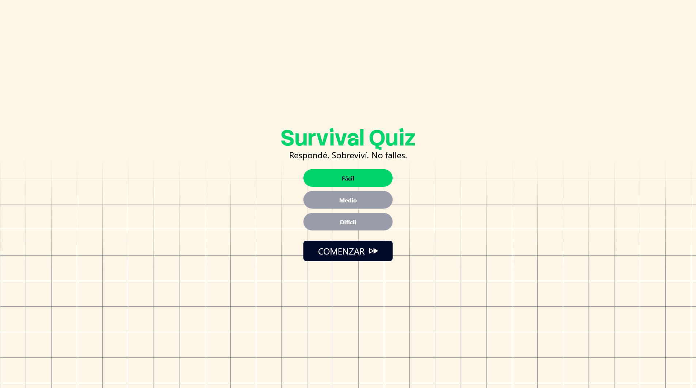
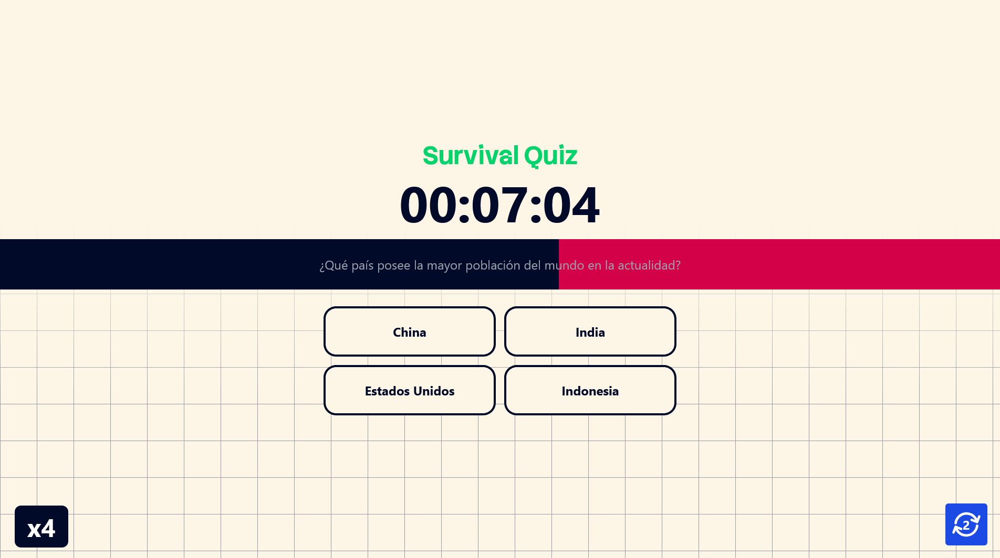
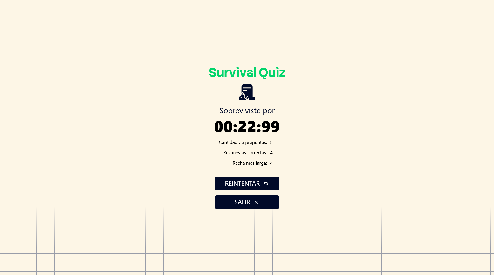

# Survival Quiz

Juego de preguntas y respuestas con temporizador de supervivencia. Respondé correctamente para ganar tiempo, pero cuidado: cada error te acerca al final. Tres niveles de dificultad cambian las reglas del juego.

**[🎮 Jugar demo](https://DiegoLeonardoSoto.github.io/survival-quiz/)**

---

## 📸 Capturas

<p align="center">
  
  &nbsp;&nbsp;
  
  &nbsp;&nbsp;
  
</p>

---

## 🧠 ¿Cómo funciona?

- Empezás con un tiempo limitado según la dificultad elegida.
- Cada pregunta tiene una barra de tiempo: si se agota, perdés tiempo de supervivencia.
- Respuesta correcta → sumás tiempo y aumentás tu racha.
- Respuesta incorrecta → perdés tiempo, se rompe la racha, y el botón queda bloqueado.
- Cada 2 aciertos en racha ganás un **refresco de pregunta** (cambia la pregunta actual sin penalización).
- El juego termina cuando el temporizador de supervivencia llega a 0.

### Dificultades

| Dificultad | Tiempo por pregunta | Recompensa (acierto) | Penalización (error) |
|---|---|---|---|
| Fácil | 10s | +5s | -2s |
| Medio | 7s | +4s | -4s |
| Difícil | 5s | +2s | -5s |

---

## 🛠 Stack

- **HTML** + **Tailwind CSS** (compilado con CLI)
- **JavaScript** vanilla con módulos ES nativos
- **[Motion](https://motion.dev/)** para animaciones
- Sin frameworks, sin build tools, sin dependencias runtime

---

## 📁 Arquitectura

Cada funcionalidad vive en su propio módulo con estado encapsulado en closures:

```
js/
├── game.js              → Entry point, decide si mostrar game over o iniciar
├── setupGame.js         → Pegamento: conecta managers, lógica de clicks
├── questionManager.js   → Estado de preguntas, validación, dificultad
├── questionTimer.js     → Temporizador por pregunta
├── survivalTimerManager.js → Temporizador de supervivencia global
├── streakManager.js     → Racha de aciertos y animaciones
├── refreshManager.js    → Botón de refrescar pregunta
├── progressTimerManager.js → Contador de tiempo transcurrido
├── gameIntroManager.js  → Animación de cuenta regresiva inicial
├── renderGameOver.js    → Pantalla de fin de partida
└── utilities.js         → formatTime()
```

La comunicación entre módulos usa **CustomEvents** (`timerStop`, `retryGame`, `refreshButtonEvent`) cuando no hay importación directa. El estado entre recargas se persiste en `sessionStorage`.

---

## 🚀 Correr localmente

```bash
git clone https://github.com/DiegoLeonardoSoto/survival-quiz.git
cd survival-quiz
```

El CSS ya está compilado (`src/output.css`). Solo necesitás un servidor local:

```bash
# Con Python
python -m http.server 8080

# O con Node
npx serve .
```

Abrí `http://localhost:8080` y jugá.

Si modificás el CSS (Tailwind), necesitás recompilar:

```bash
npx tailwindcss -i ./src/input.css -o ./src/output.css --watch
```
